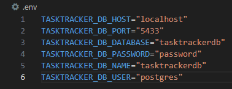

# Task Tracker

An application that helps you manage your tasks.

## Details

1. The project's backend is generated by [LoopBack 3](http://loopback.io).
2. The project's frontend is generated by [Emberjs](https://emberjs.com/). More details can be found in the client directory's README.md file.

## Prerequisites

1. Use node v10.24.1 and npm v6.14.12 to manage your dependencies
2. Use postgresql v9.6 for your database

## Installation

1. `git clone <repository-url>` this repository
2. `npm install`

## Set up backend

1. Inside the tasktracker directory, set up a .env file with your postgresql database's details: 
2. To setup the frontend, checkout the README.md file in the client directory

## Running / Development
1. To run the backend, run the command `npm run dev` inside your tasktracker directory
2. Visit your app at [http://localhost:3000](http://localhost:3000).